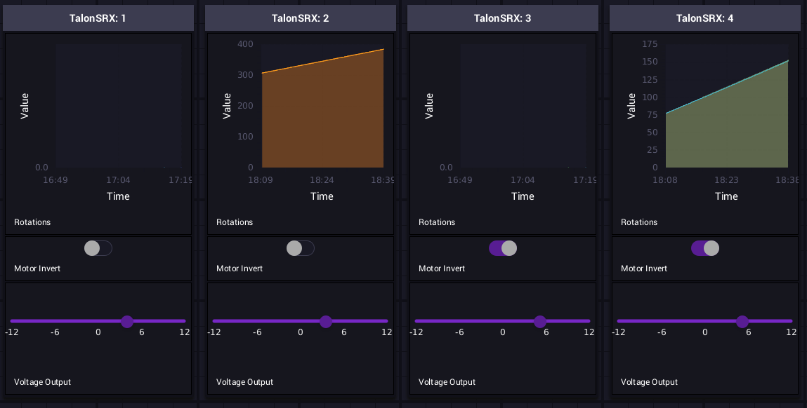

# testbench
🔧 A configurable hardware testing utility

## What & Why?

The goal of this tool is to provide an easy way to safely test hardware and prototype simple systems. Some mechanisms can only be driven from real robot hardware, and not a generic power source (like a brushless motor). In the past, every time we needed to test a motor or sensor, 5024 had to add a temporary patch into our codebase to support the test. This both causes some mess in our codebase, and requires a developer to spend time away from their other work to set everything up, and ensure the test is run safely.

The *testbench* tool brings a simple solution to this problem: A robot-agnostic, JSON-based testing framework. All that is needed to test a motor or sensor with *testbench* is a few lines in a configuration file, and the click of a button.

## Configuring

The *testbench* configuration file (stored at `./src/main/deploy/hardwareConfig.json`) is split into the following sections:

 - Motors
 - Pneumatics
 - Sensors
   - Digital
   - Analog
   - Gyroscopes

### Configuring a motor

The following is the motor configuration schema:

```js
{
    // Communication bus type. This is how the motor controller 
    // is connected to the RoboRIO. Can be one of:
    // - CAN
    // - PWM
    "bus_type": "CAN", // REQUIRED

    // Motor controller type. Can be one of:
    // - TalonSRX
    // - TalonFX
    // - VictorSPX
    // - Spark
    // - BrushlessSparkMax
    // - BrushedSparkMax
    // Use "brushless" for brushless motors like the REVRobotics NEO motor.
    "controller": "TalonSRX", // REQUIRED

    // Device ID (Either CAN id or PWM port number)
    "id": 1, // REQUIRED

    // Minimum and maximum output in volts
    "max_output": 12.0,  // OPTIONAL
    "min_output": -12.0, // OPTIONAL

    // If the motor is inverted
    "inverted": false, // OPTIONAL

    // If the motor controller has an encoder connected, this should be set 
    // to the number of encoder ticks per rotation. Default is 4096
    "cpr": 4096 // OPTIONAL
}
```

## Deploying to a robot

The deploy process is identical to any other robot program. Just run:

```sh
# Linux
./gradlew deploy

# Windows
.\gradlew.bat deploy
```

## Screenshots



*Motor control & status panel*

## Full example config file

```js
{
    "motors": [
        {
            "bus_type": "CAN",
            "controller": "TalonSRX",
            "id": 1,
            "max_output": 12.0,
            "min_output": -12.0,
            "inverted": false
        },
        {
            "bus_type": "CAN",
            "controller": "TalonSRX",
            "id": 2,
            "max_output": 12.0,
            "min_output": -12.0,
            "inverted": false,
            "encoderCPR":1400
        },
        {
            "bus_type": "CAN",
            "controller": "TalonSRX",
            "id": 3,
            "max_output": 12.0,
            "min_output": -12.0,
            "inverted": true
        },
        {
            "bus_type": "CAN",
            "controller": "TalonSRX",
            "id": 4,
            "max_output": 12.0,
            "min_output": -12.0,
            "inverted": true,
            "encoderCPR":1400
        }
    ],
    "pcm": {
        "can_id": 8
    },
    "sensors": {
        "digital": [
            {"id": 0}
        ],
        "analog": [
            {"id": 0}
        ],
        "gyros": [
            {
                "type": "NavX",
                "port": "MXP"
            }
        ]
    }
}
```